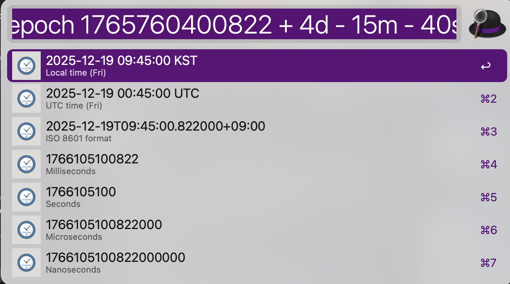
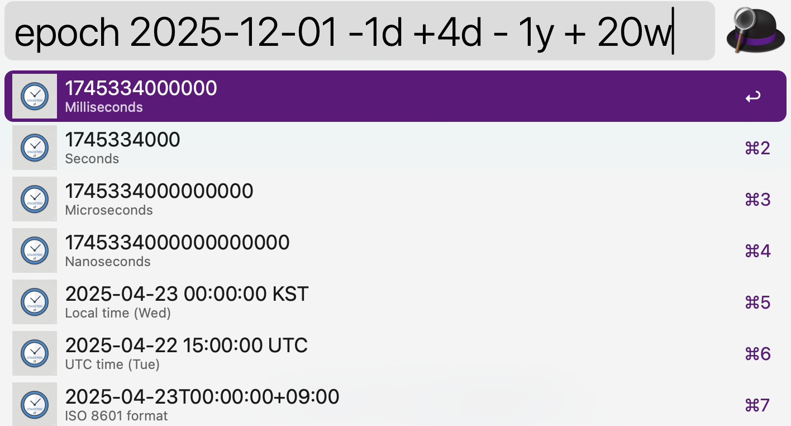

# Alfred Epoch Converter

Alfred Workflow for converting between epoch timestamps and human-readable dates.

## Features

- Convert current time to epoch (milliseconds, seconds, microseconds, nanoseconds)
- Convert epoch timestamps to dates
- Convert date strings to epoch timestamps
- Time arithmetic operations (add/subtract time)
- Multiple date format support
- Auto-fill current year for month/day only inputs
- Display day of week (Mon, Tue, etc.)
- Show both local time and UTC time

## Usage

### Get Current Time
Type the keyword with no arguments:
```
epoch
```

### Convert Epoch to Date
Enter an epoch timestamp:
```
epoch 1733900000
epoch 1733900000000  (milliseconds)
```

### Convert Date to Epoch
Enter a date string:
```
epoch 2024-12-11
epoch 2024/12/11 14:30:00
epoch 12/25  (uses current year)
```

### Time Arithmetic
Add or subtract time from current time, epoch, or date:
```
epoch + 2 hours
epoch - 3 days
epoch 1733900000 + 1 day
epoch 2024-12-11 - 2 weeks
```

Supported units: `s/sec/second/seconds`, `m/min/minute/minutes`, `h/hour/hours`, `d/day/days`, `w/week/weeks`, `M/month/months`, `y/year/years`

## Supported Date Formats

- `YYYY-MM-DD HH:MM:SS.fff`
- `YYYY-MM-DD HH:MM:SS`
- `YYYY-MM-DD HH:MM`
- `YYYY-MM-DD`
- `YYYY/MM/DD HH:MM:SS`
- `YYYY/MM/DD`
- `MM/DD` (current year)
- `MM DD` (current year)

## Screenshots




## Installation

1. Download the `.alfredworkflow` file
2. Double-click to install in Alfred
3. Set your preferred keyword (default: `epoch`)

## Requirements

- Alfred 4+ with Powerpack
- Python 3.9+

## Development

```bash
# Activate virtual environment
source .venv/bin/activate

# Install dependencies
pip install -e .
```
